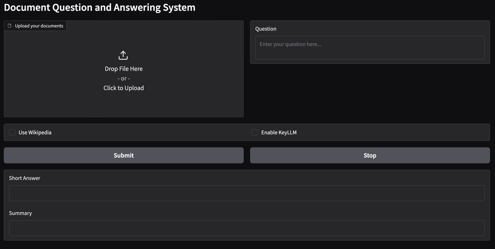

# DNLP_project

## Introduction


You can find the report of the project [here]!(https://github.com/yourusername/DNLP_project/blob/main/report.pdf).

## Features


## Installation
To install the necessary dependencies, run:
```bash
pip install -r requirements.txt
```

## Usage
To use the project, run the following command:
```bash
python main.py
```

## Visual Example
Here is an example of the system's graphical interface:



## Contributors
- Tommaso Mazzarini - email
- Leonardo Merelli - email
- Riccardo Pisanu - email
- Giovanni Stina - email

## License
This project is licensed under the MIT License.